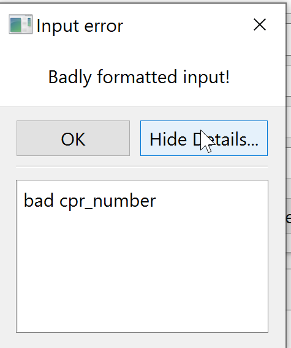

Suggested solution to Exercise 5_2:

Task:
```
Create a graphical user interface (GUI) for the employee class in task 1```
```


The GUI has been created in Designer as a widget with vertical layout and containing
a form layout widget for the inputs and a horizontal layout widget for the buttons.

`NewEmployeeGUI.py` loads the `NewEmployee.ui` file and defines the control methods
for the buttons.
Note that I have updated the `Employee` class in `Employee.py` with a try/except
clause that raises and exception if the cpr number is badly formatted. (This is simply
done by trying if it is possible to calculate an age from the cpr number).



Actually all the inputs should be validated - through a Validator class or through the PyQT QRegExpValidator method - 
and exceptions should be raised. This will allow for informative messages to the end-user if
something is wrong. See an example with QRegExpValidator here https://www.ics.com/blog/qt-support-input-masks-and-validators


