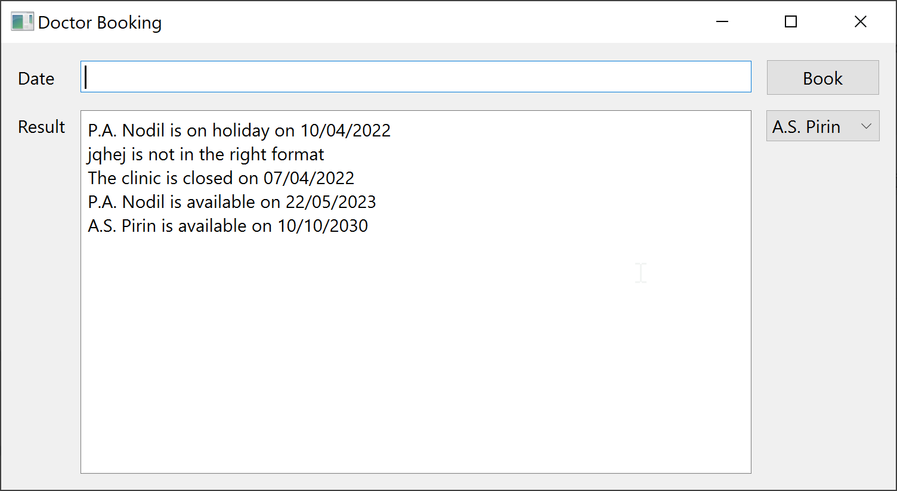

# Week 4_2 and 4_3 Exercise proposed solution

*Create a graphical user interface for the appointment booking task in the previous exercise.*

*Create a program that collects errors from inputs using try-catch statements. When the user enters the wishes for an appointment, he/she might input dates using different formats (for instance "4/10/21" and "Fourth of July". Ensure that the input corresponds to the format dd/mm/yyyy. Use exceptions to provide feedback to the user in case there was an error with the input received.*

We will make one solution to cover both tasks as a whole.

Input validation is done through a separate Class `DataValidator` in the `DataValidator.py` file

In the `DataValidator` class we introduce the use of `datetime.strptime` and `datetime.strftime` to parse a date or
convert it to string in a given format - in our case ""%d/%m/%Y" meaning 'day of month in 2 digits, a "/", month in 2 digits,
a "/" and year in for digits - see **strftime() and strptime() Format Codes** in 
https://docs.python.org/3.9/library/datetime.html

We will this time make the Qt GUI programmatically (without the use of a `.ui` but directly through
the use of Qt calls) - just for the exercise. Sometimes it is easier to do it this way.
A GUI can easily be made as a mix of ui files and "on-the-fly" programmatically created
GUI's.

We will put the Qt calls in the main function. For more complex projects you might want
to split the various parts in to its own classes and/or Python files.

The layout is made using the grid Widget. You define the position of the various
GUI components (label, text boxes, buttons etc.) in a row-column layout.

Note that I have added a combobox (a searchable list to the GUI).
I then get the text from the current selected item and search for that name in the
list of doctors in or to get the index of the list and hence the referenced doctor, 
so that I can display availability for that given doctor.

(Hint: A smarter way could be to use a hashmap or dictionary of doctors with the doctor's name as key.)

The GUI should look something like this when being run (note the combobox to the right): 

