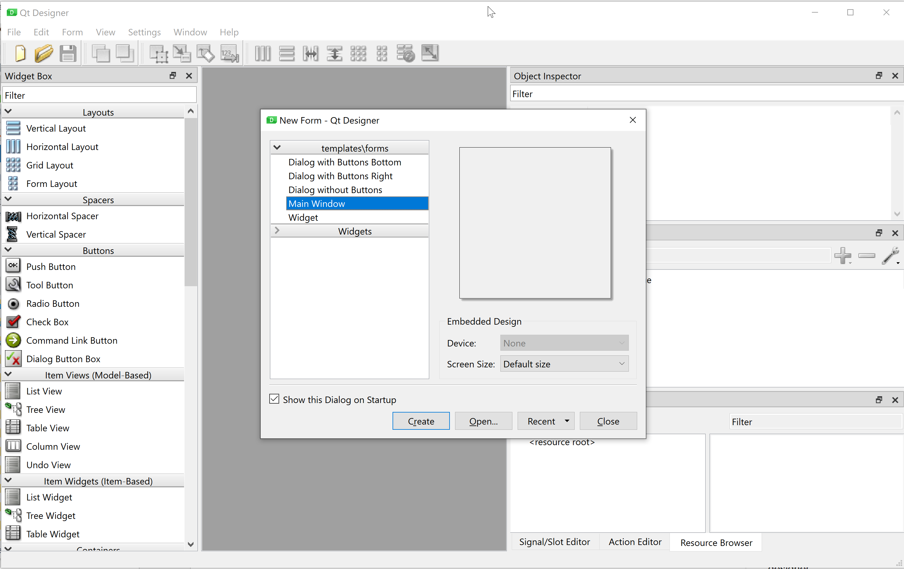
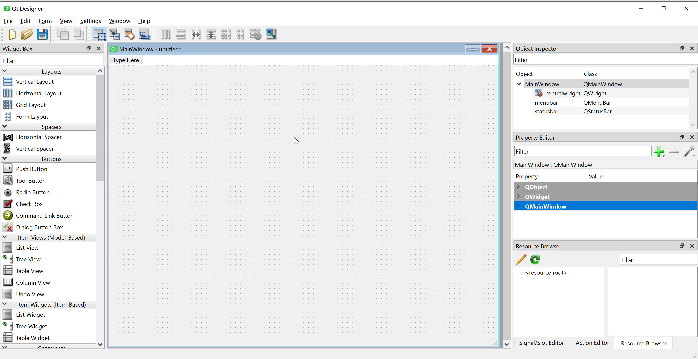
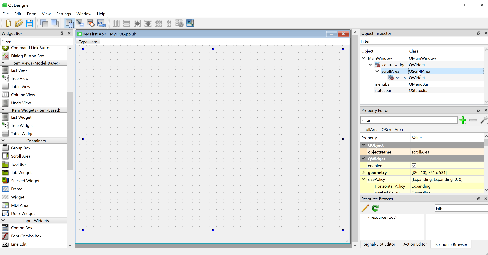

[Building a GUI](#building-a-qt-gui)  
[Creating you first GUI](#creating-your-first-simple-GUI)
# System Development Cookbook 2022

This repository is a meant as a 'bridge' between the theoretical material being
taught in ['5100-B3-4F22 - Systems Development'](https://kurser.ku.dk/course/ndab19000u/) at Copenhagen University 2022 
and the practical student exercises and assignments.

In other words it will contain small recipes on 'How do I make this or that 
Graphical User Interface (GUI) Component' or 'how do I make a class in Python' etc.

Feel free - as a student - to comment (preferably on Discord or in the course discussion on 
[Absalon](https://absalon.ku.dk/courses/56610/discussion_topics) )
and ask for enhancements if needed - or if you find good sources of knowledge, then please share!

The primary programming language taught in the course is Python (3.9.10 ) and the proposed GUI Framework for
your exercises and assignments is Qt (version 6). The examples in this Cookbook will be based on this
platform. Remember however, that you are free to use any programming language that support
Object-Oriented Programming (OOP) and any GUI framework you prefer - but then again you will
be 'on your own' and support can only be given on the basis of 'best effort'.
Lower versions of Python 3.9 as well as Qt version 5 will also work for your project.

The Cookbook assumes that you have basic knowledge of Python - obtained through the course 
[NDAB21003U Python programmering til datavidenskab](https://kurser.ku.dk/course/ndab21003u) or the equivalent.

Specific IDE instructions given are for PyCharm - again you are free to choose your own IDE...

The Cookbook assumes that you have already installed the required Python version, QT framework etc
as described in the 
[Install guide](https://docs.google.com/document/d/1pYUBz4XfURxj9aH_6geXm-jrBIohgb7S/edit)

## Building a Qt GUI

The [QT GUI framework](https://www.qt.io/) has been chosen for this course as it is a cross-platform framework 
(works on Linux, Windows and Mac as well as som other platforms like Android and iOS). 
It has similarities to that of JavaFX (for Java) and was originally meant to be used for C++ programs 
but was quickly ported to Python.

A Qt GUI can be build either by creating the UI directly using Python commands or by designing the
GUI in Qt Designer and the import it into you Python project.

For making the first mockup(s) of a GUI we find it easiest to use Qt Designer. Qt designer creates
a '.ui' file which in XML (Extensible Markup Language) describes the user interface.
This .ui file can - as said - easily be imported into your Python project but the same ui
file can also be imported into a c++ project and is thus independent of the
programming language. (We will later see that you can also compile the .ui file to Python)

There are many quick introductions to PyQT6 on the internet. One can be found
[here](https://zetcode.com/pyqt6/firstprograms/).  

The next sections will teach you how to create a GUI using Qt Designer. 

### Using Qt designer.
Depending on your OS you start Qt designer in different ways.  

**Mac**  

On Mac, the command for starting Qt Designer is `Designer`. That is: open a terminal and run the
command `Designer`. Note that Designer is with uppercase 'D'.
You can pin the Designer to your launch panel in order to quickly launch it the next time

If Designer doesn't launch it might be because Designer is not in your PATH variable.
Try to search for the file in order to get the right location.

**Windows**  

If you have installed Qt-6 in Pythons site libs (can be done by opening a Windows terminal as administrator and run
`pip intall pyqt6 pyqt6-tools`) Designer will typically be located in
`C:\Users\your-username\AppData\Local\Programs\Python\Python39\Lib\site-packages\qt6_applications\Qt\bin`

If you can't find it the search for `Designer.exe`

Please note that when you launch a new program in PyCharm you can also choose to create
a virtual environment and later on install pytqt6 and pyqt6-tools (only) into that environment.
In this case Designer will be located in something like
`path-to-your-pythonProject\venv\Lib\site-packages\PySide6`

I will recommend - for now - to have pyqt6 installed in your site libs (and not 'only' in your venv) so
that you always have the same path to designer.

### Creating your first simple GUI

When Designer is launched you are met by the following dialog:

Choose 'Main Window' and press create (leave everything else unchanged)

You will then see a window like this:

On the left-hand side you see the standard GUI components that are available
in Qt6. In the middle you see the GUI, that you are currently designing.
On the right-hand side you see the Object inspector showing the properties of
the currently selected GUI component.

As we are going to create a simple GUI we will not populate the menu bar and the status bar.
(In your assignments you might want to implement menus so
that you can quickly navigate between different parts of your application).

In the Object Inspector Right-click on the QMenuBar and select "Remove Menubar" and
do the same for the Status bar. Watch how the menubar (in the top) and status bar 
(grey line at the bottom) are removed.

Save the GUI using the File Menu -> Save as.
A good name could be "MyFirstApp.ui" and a good location will be in a newly created Pycharm project.

It is time to set some properties of the Main Window:

First let us set the title of the Main Window to 'My first App'
In the Object Inspector click on MainWindow and in the Property editor filter
on 'title' and change the value of the windowTitle property to 'My first App'.

Now let us add some functionality to the application. Why not use the program we created
in Week2 and create a GUI for our citizen registration?

We will need some input fields in order to register the name, the cpr-number and the address.
In front of the input fields we will need some labels: 'Name:', 'CPR Number', 'Street name' etc.

And then we will need a text area to display the 'registered' patient with address and information

As we will allow the Main Window to be resizable we will add scrollbars to the application,
so that we are still able to see the content even if we make the window smaller
than the 'Display area'.

We do this by adding a 'Scroll area' container. Drag it from the left side menu and into
the Designer window:

