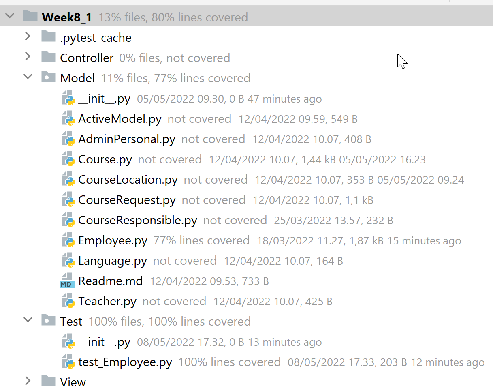
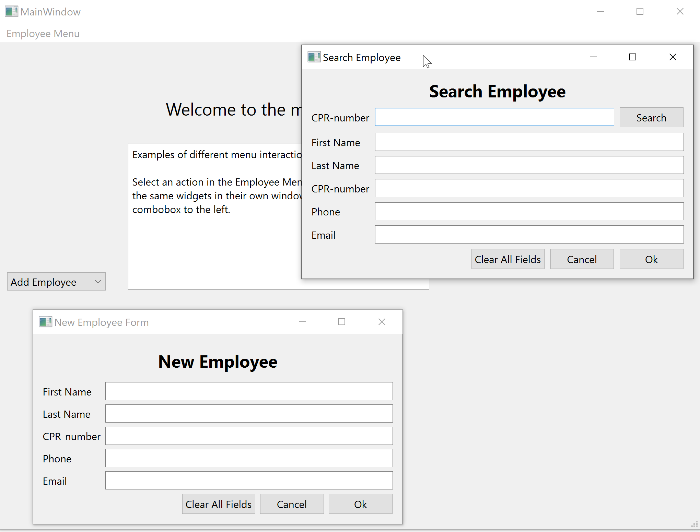

Suggested solution to Exercise 8_1:

Task:

*Revise the GUI in the exercise session in Lecture 7, and adapt your program so it implements the MVC pattern.*

In the solution to week 5 exercise 4, I have already adopted the MVC pattern, so
this is almost a replay.

I have instead added a test using the pytest framework.
See https://www.jetbrains.com/help/pycharm/pytest.html for how to set this up

If you prefer to use the unittests framework (as in the example in the course lecture) - feel free to do so, it is a matter of taste.

The Tests (test) have been placed in a separate Test folder.
Currently, the test will check if the employee class' get_age method
is working correctly (it will fail if you run this test next year -
consider how you could make the test more generic...)

NB! Take a closer look at `@pytest.fixture` which allows you to generate code/objects for
reuse in your tests

When running the test you will get a "Test Results" report showing:

```
Testing started at 17.33 ...
Launching pytest with arguments C:/Users/ja/PycharmProjects/SystemDevelopment/Exercises/Week8_1 --no-header --no-summary -q in C:\Users\ja\PycharmProjects\SystemDevelopment\Exercises\Week8_1

============================= test session starts =============================
collecting ... collected 1 item

Test/test_Employee.py::test_get_age PASSED                               [100%]

============================== 1 passed in 0.03s ==============================

Process finished with exit code 0
```

You can choose to run the test with coverage (next to the debug icon)
Then you will see something like this:



As you see each directory and file is annotated with the
level of coverage. A well written unit test should cover all and not only parts of the code.
To a certain extent....In this course we will focus on testing the methods in our model.
Testing the actual pyqt GUI can be quite tricky and will involve pytest plugin
libraries like https://pypi.org/project/pytest-qt/ which we will not cover here.


# MVC pattern

The program is build in a Model View Controller pattern. 

## Model
The requested classes are placed in a 'Model' folder
in order to get a better overview. Not all classes have been fully deployed as the solution is dependent on 
your various project solutions. However, the solution should give you an idea on howto make the class constructors,
use class inheritance, user properties, getters and setters etc.

The ActiveModel Class is a static class that holds the current state of the system - currently only the list of employees. It can
easily be expanded to hold the course list, the teacher list etc.

## View
The View is made with the ui files created in QT Designer. It consists of a Main Window which have a top menu,
and then there is a combobox menu in the left site and a stacked widget in the right part of screen.

MainWindowDescription.ui defines a widget with a simple text stating what you can do in the application

NewEmployee.ui defines a widget to add new employees to the system (we do not have a persistent layer yet, so
they will not be stored, when the application is closed). 

SearchEmployee.ui defines a widget with a search form, where you can search an employee by cpr number.
Pressing OK will make this the active/current employee in the ActiveModel class and can then e.g. be used
if you want to present a Course schedule for that employee... (for you to program)




## Controller

The Controller folder holds the classes which load the ui files from the view and handles the user input
and output.

The MainWindowGUI class loads the MainWindow.ui file and also instantiate the other widgets
and load them in the stacked widget.

The search- and add-employee forms can either be launched from the top menu or from the combobox menu.
From the top menu I have chosen to launch the forms in the stacked widget (for the exercise). 
From the combobox the forms are launched in their own windows (just to show that this can also be done).

# Summarization

Try to run the program and watch the console. Try to add some employees and see how the employees
are added to the Model. Search an employee and click ok. Watch how the Models active employee changes.

Several things are missing before this becomes a useful piece of software: e.g. check if there is
already a person with the same CPR-number in the system, when you add an employee.
But we now how a good starting point.


