[Building a GUI](#building-a-qt-gui)  
[Creating you first GUI](#creating-your-first-simple-gui)  
[The UI file](#the-ui-file)  
[PantUML](#uml-using-plantuml)  
[Python OOP](#python-oop)  
[Creating an application using a GUI](#creating-an-application-using-a-gui)


# System Development Cookbook 2022

This repository is a meant as a 'bridge' between the theoretical material being
taught in ['5100-B3-4F22 - Systems Development'](https://kurser.ku.dk/course/ndab19000u/) at Copenhagen University 2022 
and the practical student exercises and assignments.

In other words it will contain small recipes on 'How do I make this or that 
Graphical User Interface (GUI) Component' or 'how do I make a class in Python' etc.

Feel free - as a student - to comment (preferably on Discord or in the course discussion on 
[Absalon](https://absalon.ku.dk/courses/56610/discussion_topics) )
and ask for enhancements if needed - or if you find good sources of knowledge, then please share!

The primary programming language taught in the course is Python (3.9.10 ) and the proposed GUI Framework for
your exercises and assignments is Qt (version 6). The examples in this Cookbook will be based on this
platform. Remember however, that you are free to use any programming language that support
Object-Oriented Programming (OOP) and any GUI framework you prefer - but then again you will
be 'on your own' and support can only be given on the basis of 'best effort'.
Lower versions of Python 3.9 as well as Qt version 5 will also work for your project.


The Cookbook assumes that you have basic knowledge of Python - obtained through the course 
[NDAB21003U Python programmering til datavidenskab](https://kurser.ku.dk/course/ndab21003u) or the equivalent.

Specific IDE instructions given are for PyCharm - again you are free to choose your own IDE...

The Cookbook assumes that you have already installed the required Python version, QT framework etc
as described in the 
[Install guide](https://docs.google.com/document/d/1pYUBz4XfURxj9aH_6geXm-jrBIohgb7S/edit)

## Building a Qt GUI
[to top ^](#system-development-cookbook-2022)


The [QT GUI framework](https://www.qt.io/) has been chosen for this course as it is a cross-platform framework 
(works on Linux, Windows and Mac as well as som other platforms like Android and iOS). 
It has similarities to that of JavaFX (for Java) and was originally meant to be used for C++ programs 
but was quickly ported to Python.

A Qt GUI can be build either by creating the UI directly using Python commands or by designing the
GUI in Qt Designer and the import it into you Python project.

For making the first mockup(s) of a GUI we find it easiest to use Qt Designer. Qt designer creates
a '.ui' file which in XML (Extensible Markup Language) describes the user interface.
This .ui file can - as said - easily be imported into your Python project but the same ui
file can also be imported into a c++ project and is thus independent of the
programming language. (We will later see that you can also compile the .ui file to Python)

There are many quick introductions to PyQT6 on the internet. One can be found
[here](https://zetcode.com/pyqt6/firstprograms/).  

The next sections will teach you how to create a GUI using Qt Designer. 

### Using Qt designer
[to top ^](#system-development-cookbook-2022)


Depending on your OS you start Qt designer in different ways.  

**Mac**  

On Mac, the command for starting Qt Designer is `Designer`. That is: open a terminal and run the
command `Designer`. Note that Designer is with uppercase 'D'.
You can pin the Designer to your launch panel in order to quickly launch it the next time

If Designer doesn't launch it might be because Designer is not in your PATH variable.
Try to search for the file in order to get the right location.


**Windows**  

If you have installed Qt-6 in Pythons site libs (can be done by opening a Windows terminal as administrator and run
`pip install pyqt6 pyqt6-tools`) Designer will typically be located in
`C:\Users\your-username\AppData\Local\Programs\Python\Python39\Lib\site-packages\qt6_applications\Qt\bin`

If you can't find it the search for `Designer.exe`

Please note that when you launch a new program in PyCharm you can also choose to create
a virtual environment and later on install pytqt6 and pyqt6-tools (only) into that environment.
In this case Designer will be located in something like
`path-to-your-pythonProject\venv\Lib\site-packages\PySide6`

I will recommend - for now - to have pyqt6 installed in your site libs (and not 'only' in your venv) so
that you always have the same path to designer.


### Creating your first simple GUI
[to top ^](#system-development-cookbook-2022)

When Designer is launched you are met by the following dialog:


Choose 'Main Window' and press create (leave everything else unchanged)

You will then see a window like this:


On the left-hand side you see the standard GUI components that are available
in Qt6. In the middle you see the GUI, that you are currently designing.
On the right-hand side you see the Object inspector showing the properties of
the currently selected GUI component.

As we are going to create a simple GUI we will not populate the menu bar and the status bar.
(In your assignments you might want to implement menus so
that you can quickly navigate between different parts of your application).

Save the GUI using the File Menu -> Save as.
A good name could be "MyFirstApp.ui" and a good location will be in a newly created Pycharm project.

It is time to set some properties of the Main Window:

First let us set the title of the Main Window to 'My first App'
In the Object Inspector click on MainWindow and in the Property editor filter
on 'title' and change the value of the windowTitle property to 'My first App'.


Now let us add some functionality to the application. Why not use the program we created
in Week2 and create a GUI for our citizen registration?

We will need some input fields in order to register the name, the cpr-number and the address.
In front of the input fields we will need some labels: 'Name:', 'CPR Number', 'Street name' etc.

And then we will need a text area to display the 'registered' patient with address and information

As we will allow the Main Window to be resizable we will add scrollbars to the application,
so that we are still able to see the content even if we make the window smaller
than the 'Display area'.

We do this by adding a 'Scroll area' container. Drag it from the left side menu and into
the Designer window and resize it to fit the application 
(yes we could set some more generic constraints - but we won't
do that for now):


Now we are missing insertion of labels, input fields and
underneath a textarea widget to display the result.

We could do this by adding labels and Line Edit widgets and place them manualer.
The Grid layout or vertical layouts could help os in order to distribute
the widgets evenly over the screen.  
However we will use the [Form Layout](https://doc.qt.io/qt-6/qformlayout.html).
It as a label and input field and the layout is made in an 'OS native' fashion.

Drag the "Form Layout" into the application and resize it to a suitable size

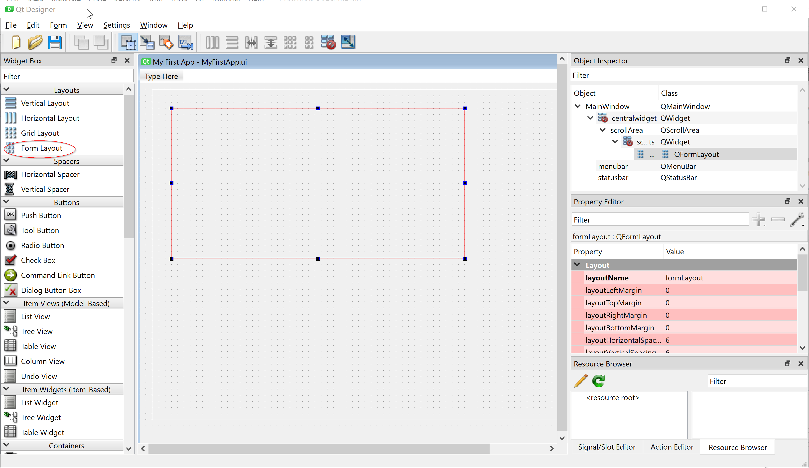

Now time to insert a form row: Right-click in the form layout and select "Add form layout row".
Fill in the form like this and press OK:

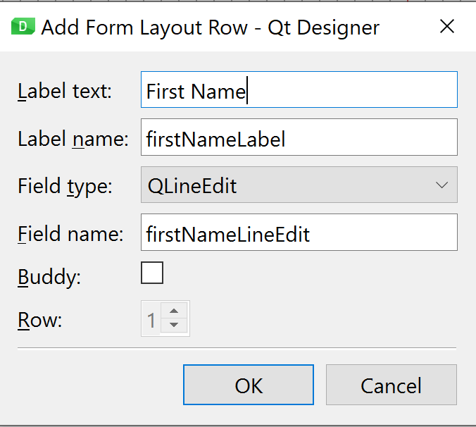

The two names are important - those are the ones that at link to your Python code.
Leave them as suggest.

The result after pressing OK is
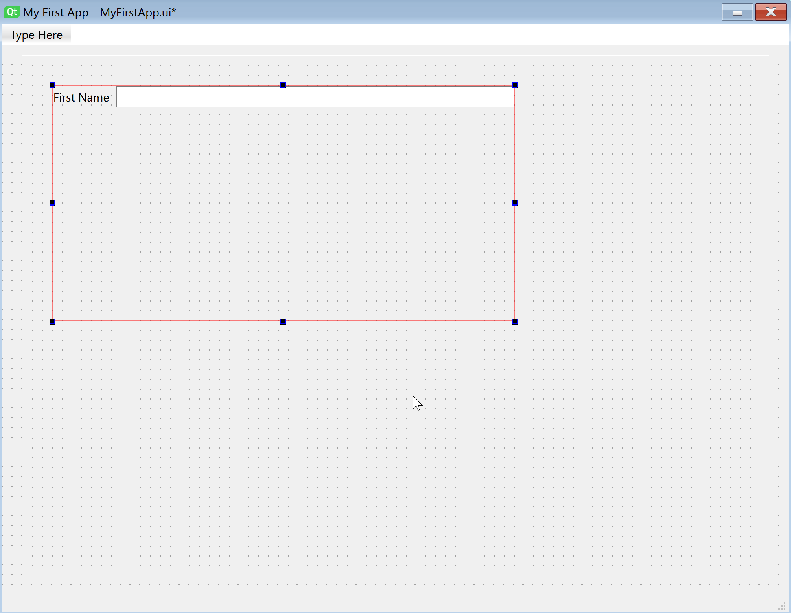


Now continue to add rows for surname, cpr-number, street, street number, extension (e.g. 1.tv),
zipcode and city:

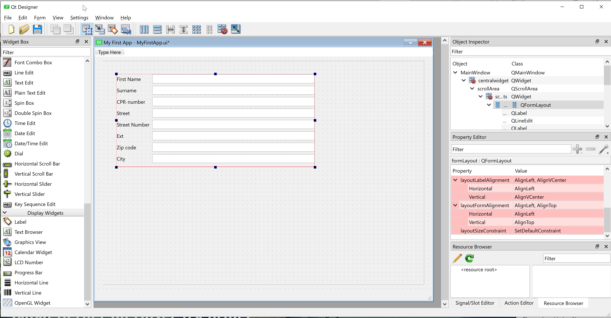

Let us add some 'Push Buttons' For "Register Patient" and "Clear Fields".
You can right-click on the buttons in order to change the text and the object names.

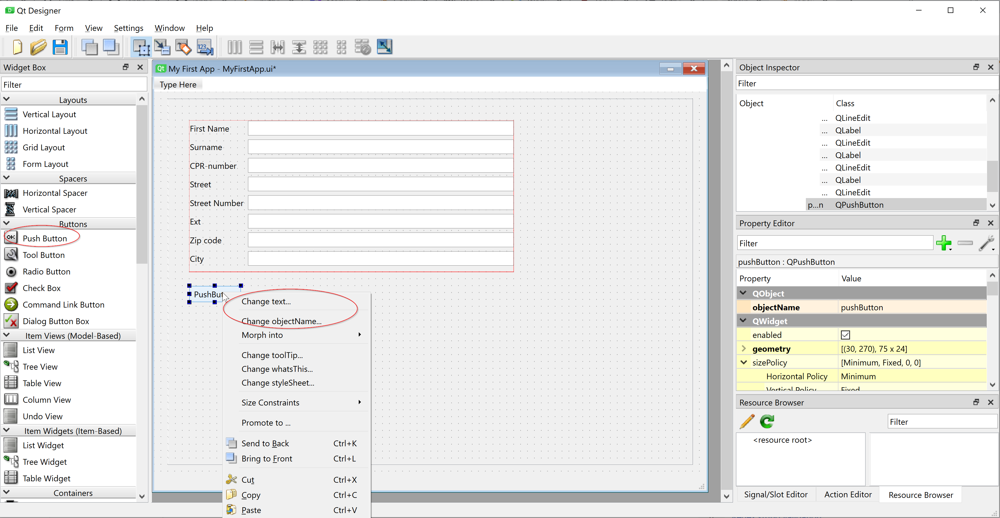

Finally add a "Text Edit Field" (We will need in order to display the output -
Yes it will be a boring application: It will display the inputs together with
a computed age - it is only made for demonstration purposes and to give you
an idea of what is possible and easy to create wth QT Designer).

The result should look something like this:

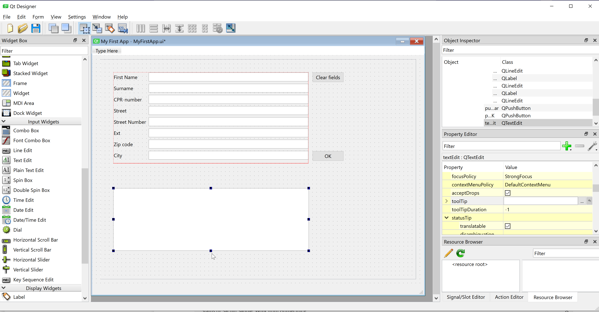

Using the preview (in the forms menu) I get..

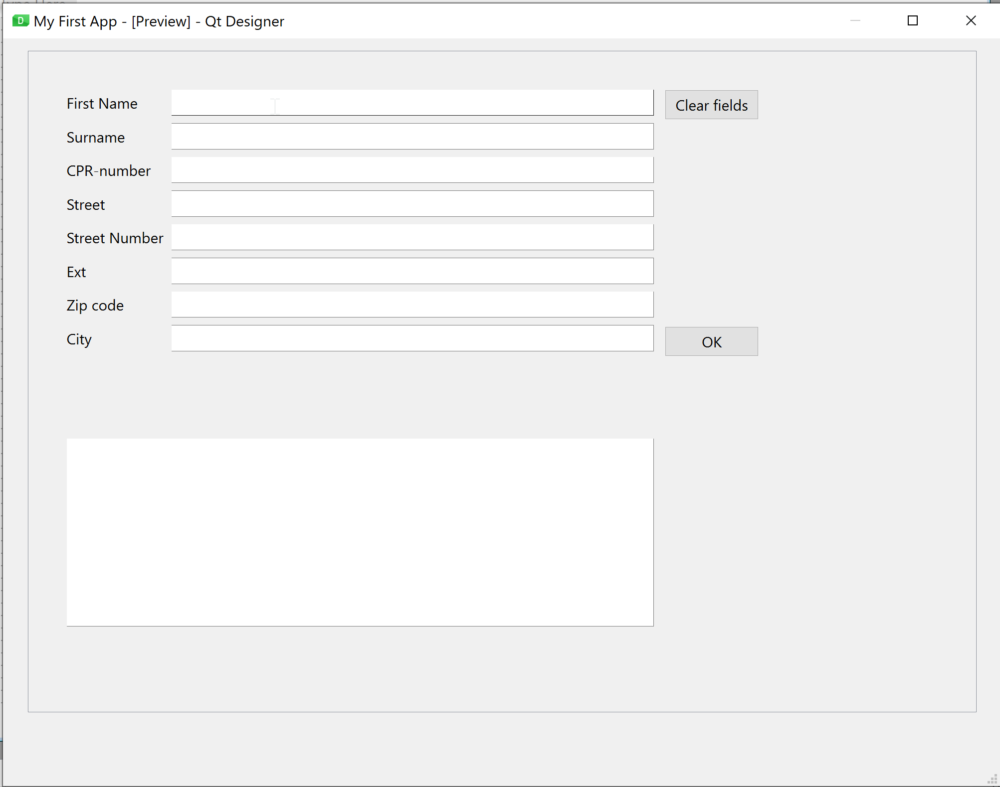


Please notice all the properties you can set on the text fields:
Among others you have tooltips (that is display a little message, when you hover the mouse
over the field) and input masks (That is: allow only certain characters for the input -
practical for CPR numbers)

For a mockup it can also be practical to set some sample text for the input fields.
Feel free to do so! And notice that you can save the UI as an image (png) file.


### The UI file
[to top ^](#system-development-cookbook-2022)

Let us have a look at the resulting ui file (or the first part of it).

```xml
<?xml version="1.0" encoding="UTF-8"?>
<ui version="4.0">
 <class>MainWindow</class>
 <widget class="QMainWindow" name="MainWindow">
  <property name="geometry">
   <rect>
    <x>0</x>
    <y>0</y>
    <width>800</width>
    <height>600</height>
   </rect>
  </property>
  <property name="windowTitle">
   <string>My First App</string>
  </property>
  <widget class="QWidget" name="centralwidget">
   <widget class="QScrollArea" name="scrollArea">
    <property name="geometry">
     <rect>
      <x>20</x>
      <y>10</y>
      <width>761</width>
      <height>531</height>
     </rect>
    </property>
    <property name="widgetResizable">
     <bool>true</bool>
    </property>
    <widget class="QWidget" name="scrollAreaWidgetContents">
     <property name="geometry">
      <rect>
       <x>0</x>
       <y>0</y>
       <width>759</width>
       <height>529</height>
      </rect>
     </property>
     <widget class="QWidget" name="formLayoutWidget">
      <property name="geometry">
       <rect>
        <x>30</x>
        <y>30</y>
        <width>471</width>
        <height>221</height>
       </rect>
      </property>
      <layout class="QFormLayout" name="formLayout">
       <item row="0" column="0">
        <widget class="QLabel" name="firstNameLabel">
         <property name="text">
          <string>First Name</string>
         </property>
        </widget>
       </item>
       <item row="0" column="1">
        <widget class="QLineEdit" name="firstNameLineEdit">
         <property name="toolTip">
          <string/>
         </property>
         <property name="inputMask">
          <string/>
         </property>
         <property name="text">
          <string/>
         </property>
         <property name="placeholderText">
          <string/>
         </property>
         <property name="clearButtonEnabled">
          <bool>true</bool>
         </property>
        </widget>
       </item>
....

```

The full file is located in the repository.

It is an XML (Extensible Markup Language) file and each GUI component
is described via tags and properties. The important ones for now will
be the property names as we will need them in order to refer to them in the Python program.
Other properties can easily be changed via a normal text editor (I can recommend notepad++
if you are using Windows) or you can set up PyCharm as your default editor for UI files.

XML is - as said - a Markup language. You will learn about it later in the course.
Other examples of markup language are HTML or Markdown (which is used to create this cookbook)


## UML using PlantUML
[to top ^](#system-development-cookbook-2022)

The UML (Unified Modeling Language) diagrams for your project can be generated via
The PlantUML plugin in PyCharm (or VScode if you are using VScode).

If you haven't installed the plugin yet, then find it in preferences/settings->plugin->Marketplace
and install it.

It requires that you have installed graphviz (the VScode plugin does that 'automagically' on both Mac
and Windows. In PyCharm we must do a little extra work). 
On Mac you will need to install graphviz via the command `brew install graphviz`.
After you have installed graphviz, then run `which dot`. It should display
something like `/usr/local/bin/dot`.
In Pycharm settings/preferences insert the found result here and you should be
able to render diagrams in plantUML (note that on the implementation on my Windows laptop this 
field is empty.)

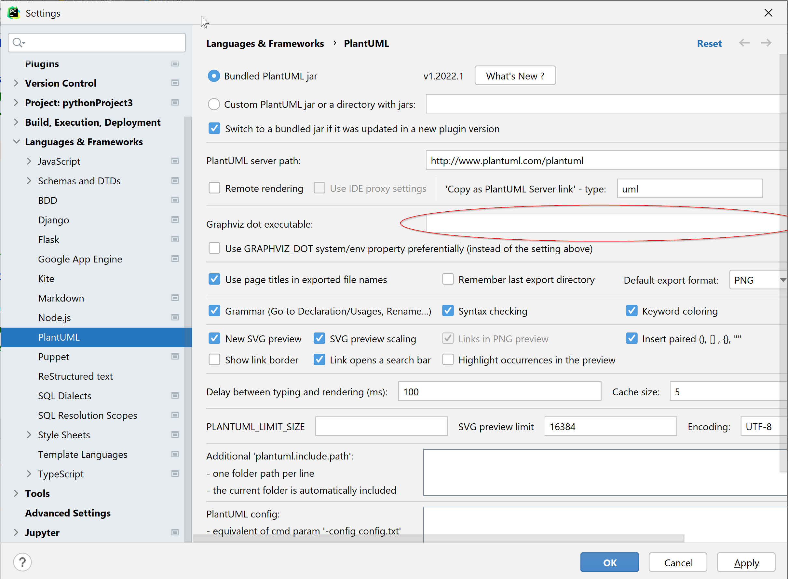

You should now be ready to create your first diagrams:

Right-click in your project explorer and select new and PlantUML File:
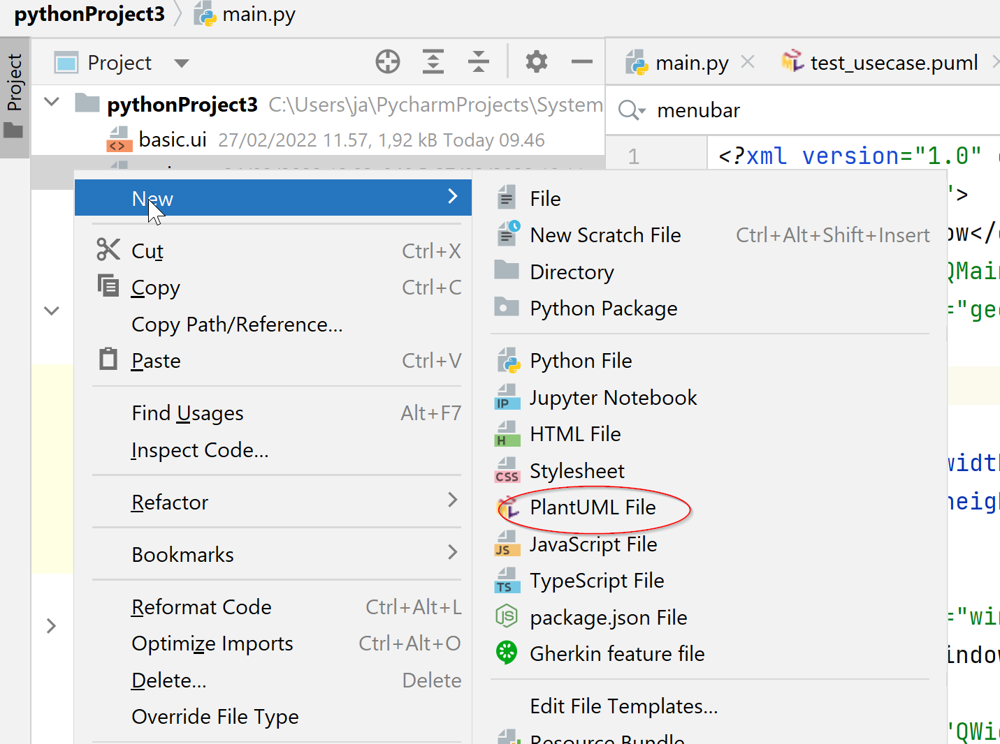

Now select the type of diagram you are going to create.

Here are the generated e xamples of use case and class diagrams:

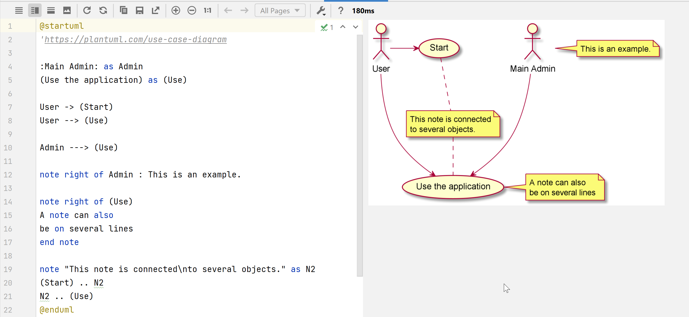
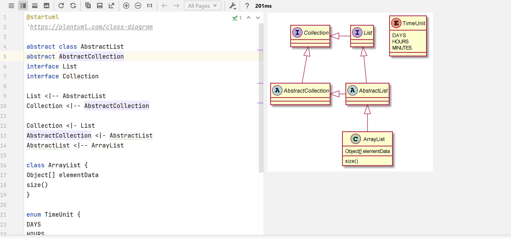

Full documentation for PlantUML syntax and a collection of examples can be 
found here https://plantuml.com/ and here https://real-world-plantuml.com/

Happy UML'ing!

## Python OOP
[to top ^](#system-development-cookbook-2022)

As this is also a course in how to develop software that can easily/easier be reused
I will simply not reinvent the whell but instead advise you to spend some minutes with this excellent guide on basic OOP in 
Python: https://realpython.com/python3-object-oriented-programming/ 

Key take-outs are  
- Classes vs instances (objects)
- Methods (at class and instance level)
- How to instantiate and object (the `__init__` metod - the contructor)
- Special Instance methods (`__str__` - to represent the object as a string)
- Class Inheritance

Once you have familiarized yourself with these basic concepts you might
also want to consult the following page https://realpython.com/instance-class-and-static-methods-demystified/
that explains the difference between instance methods, class methods and static methods (the
latter typically being used for supporting e.g. functions that are independent of
the class or objects).

You might have learned about private, public and protected attributes and methods.
As can be seen here
https://betterprogramming.pub/public-private-and-protected-access-modifiers-in-python-9024f4c1dd4 
the implementation in Python is not strict as in Java or C++ .
The notation being used (`__`for private, `_` for protected) is more to be seen as 
a **strong** recommendation on not to access the attribute from outside the class,
but it is technically still possible (but please don't!)...
A good practise would be to go with properties as explained here in order to get
managed attributes: https://realpython.com/python-property/

For now don't worry too much - we will get to see some examples in the weekly exercises and in this cookbook.

## Creating an application using a GUI
[to top ^](#system-development-cookbook-2022)
We have now created a graphical user interface. In week 1 and 2 of the course we created a small
program that just used the console as input.

Let us create a fully workable application with the user interface we just created.


