# System Development Cookbook 2022

## TOC

[Building a GUI](#building-a-qt-gui)  
- [Using Qt Designer](#using-qt-designer)
- [Creating you first GUI](#creating-your-first-simple-gui)  
- [The UI file](#the-ui-file)  

[PantUML](#uml-using-plantuml)  
[Python OOP](#python-oop)  
[Creating an application using a GUI](#creating-an-application-using-a-gui)  
- [The Python file for the GUI](#the-python-file-for-the-gui)

[Working with Classes in Python](#working-with-classes-in-python)
- [A note on setters and getters](#a-note-on-setters-and-getters)

[Generating and parsing XML files](#generating-and-parsing-xml-files)

This repository is a meant as a 'bridge' between the theoretical material being
taught in ['5100-B3-4F22 - Systems Development'](https://kurser.ku.dk/course/ndab19000u/) at Copenhagen University 2022 
and the practical student exercises and assignments.

In other words it will contain small recipes on 'How do I make this or that 
Graphical User Interface (GUI) Component' or 'how do I make a class in Python' etc.

Feel free - as a student - to comment (preferably on Discord or in the course discussion on 
[Absalon](https://absalon.ku.dk/courses/56610/discussion_topics) )
and ask for enhancements if needed - or if you find good sources of knowledge, then please share!

The primary programming language taught in the course is Python (3.9.10 ) and the proposed GUI Framework for
your exercises and assignments is Qt (version 6). The examples in this Cookbook will be based on this
platform. Remember however, that you are free to use any programming language that support
Object-Oriented Programming (OOP) and any GUI framework you prefer - but then again you will
be 'on your own' and support can only be given on the basis of 'best effort'.
Lower versions of Python 3.9 as well as Qt version 5 will also work for your project.


The Cookbook assumes that you have basic knowledge of Python - obtained through the course 
[NDAB21003U Python programmering til datavidenskab](https://kurser.ku.dk/course/ndab21003u) or the equivalent.

Specific IDE instructions given are for PyCharm - again you are free to choose your own IDE...

The Cookbook assumes that you have already installed the required Python version, QT framework etc
as described in the 
[Install guide](https://docs.google.com/document/d/1pYUBz4XfURxj9aH_6geXm-jrBIohgb7S/edit)

## Building a Qt GUI
[to top ^](#system-development-cookbook-2022)


The [QT GUI framework](https://www.qt.io/) has been chosen for this course as it is a cross-platform framework 
(works on Linux, Windows and Mac as well as som other platforms like Android and iOS). 
It has similarities to that of JavaFX (for Java) and was originally meant to be used for C++ programs 
but was quickly ported to Python.

A Qt GUI can be build either by creating the UI directly using Python commands or by designing the
GUI in Qt Designer and the import it into you Python project.

For making the first mockup(s) of a GUI we find it easiest to use Qt Designer. Qt designer creates
a '.ui' file which in XML (Extensible Markup Language) describes the user interface.
This .ui file can - as said - easily be imported into your Python project but the same ui
file can also be imported into a c++ project and is thus independent of the
programming language. (We will later see that you can also compile the .ui file to Python)

There are many quick introductions to PyQT6 on the internet. One can be found
[here](https://zetcode.com/pyqt6/firstprograms/).  

The next sections will teach you how to create a GUI using Qt Designer. 

### Using Qt designer
[to top ^](#system-development-cookbook-2022)


Depending on your OS you start Qt designer in different ways.  

**Mac**  

On Mac, the command for starting Qt Designer is `Designer`. That is: open a terminal and run the
command `Designer`. Note that Designer is with uppercase 'D'.
You can pin the Designer to your launch panel in order to quickly launch it the next time

If Designer doesn't launch it might be because Designer is not in your PATH variable.
Try to search for the file in order to get the right location.


**Windows**  

If you have installed Qt-6 in Pythons site libs (can be done by opening a Windows terminal as administrator and run
`pip install pyqt6 pyqt6-tools`) Designer will typically be located in
`C:\Users\your-username\AppData\Local\Programs\Python\Python39\Lib\site-packages\qt6_applications\Qt\bin`

If you can't find it the search for `Designer.exe`

Please note that when you launch a new program in PyCharm you can also choose to create
a virtual environment and later on install pytqt6 and pyqt6-tools (only) into that environment.
In this case Designer will be located in something like
`path-to-your-pythonProject\venv\Lib\site-packages\PySide6`

I will recommend - for now - to have pyqt6 installed in your site libs (and not 'only' in your venv) so
that you always have the same path to designer.


### Creating your first simple GUI
[to top ^](#system-development-cookbook-2022)

When Designer is launched you are met by the following dialog:

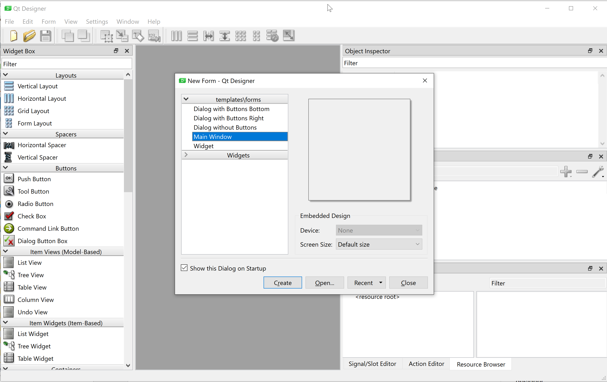

Choose 'Main Window' and press create (leave everything else unchanged)

You will then see a window like this:

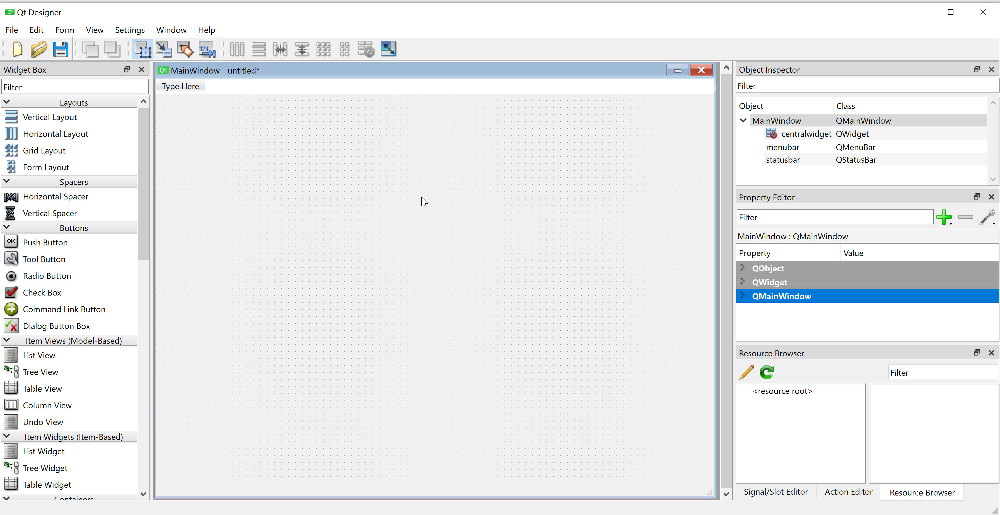

On the left-hand side you see the standard GUI components that are available
in Qt6. In the middle you see the GUI, that you are currently designing.
On the right-hand side you see the Object inspector showing the properties of
the currently selected GUI component.

As we are going to create a simple GUI we will not populate the menu bar and the status bar.
(In your assignments you might want to implement menus so
that you can quickly navigate between different parts of your application).

Save the GUI using the File Menu -> Save as.
A good name could be "MyFirstApp.ui" and a good location will be in a newly created Pycharm project.

It is time to set some properties of the Main Window:

First let us set the title of the Main Window to 'My first App'
In the Object Inspector click on MainWindow and in the Property editor filter
on 'title' and change the value of the windowTitle property to 'My first App'.

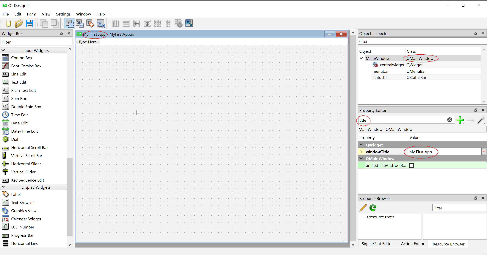


Now let us add some functionality to the application. Why not use the program we created
in Week2 and create a GUI for our citizen registration?

We will need some input fields in order to register the name, the cpr-number and the address.
In front of the input fields we will need some labels: 'Name:', 'CPR Number', 'Street name' etc.

And then we will need a text area to display the 'registered' patient with address and information

As we will allow the Main Window to be resizable we will add scrollbars to the application,
so that we are still able to see the content even if we make the window smaller
than the 'Display area'.

We do this by adding a 'Scroll area' container. Drag it from the left side menu and into
the Designer window and resize it to fit the application 
(yes we could set some more generic constraints - but we won't
do that for now):

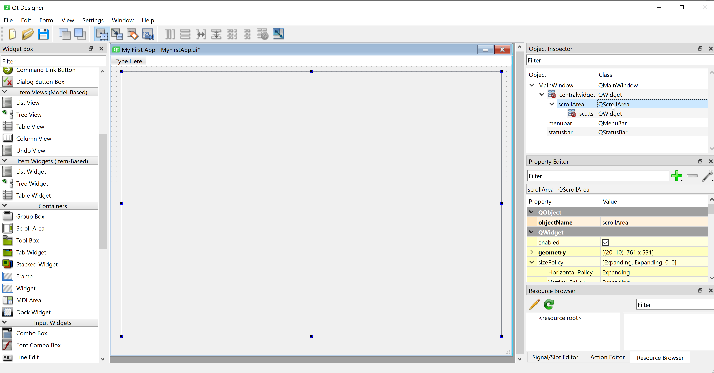

Now we are missing insertion of labels, input fields and
underneath a textarea widget to display the result.

We could do this by adding labels and Line Edit widgets and place them manually.
The Grid layout or vertical layouts could help os in order to distribute
the widgets evenly over the screen.  
However we will use the [Form Layout](https://doc.qt.io/qt-6/qformlayout.html).
It as a label and input field and the layout is made in an 'OS native' fashion.

Drag the "Form Layout" into the application and resize it to a suitable size

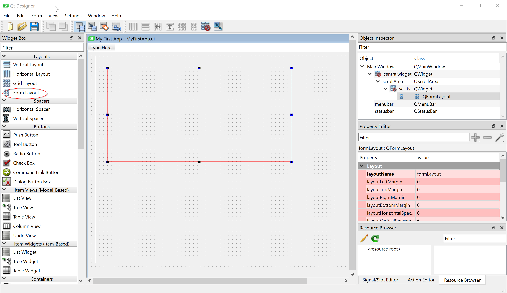

Now time to insert a form row: Right-click in the form layout and select "Add form layout row".
Fill in the form like this and press OK:

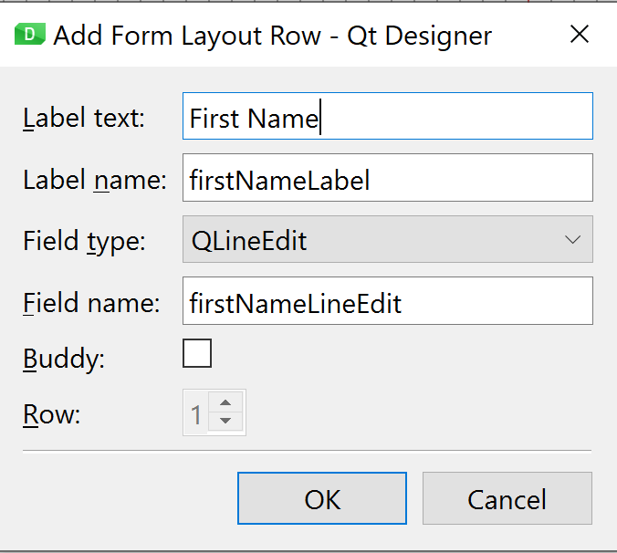

The two names are important - those are the ones that at link to your Python code.
Leave them as suggest.

The result after pressing OK is
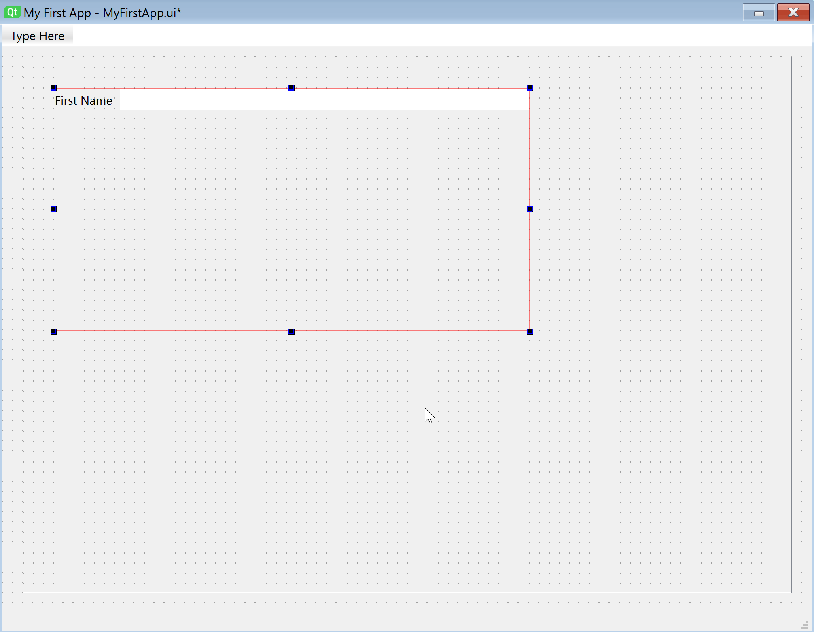


Now continue to add rows for surname, cpr-number, street, street number, extension (e.g. 1.tv),
zipcode and city:

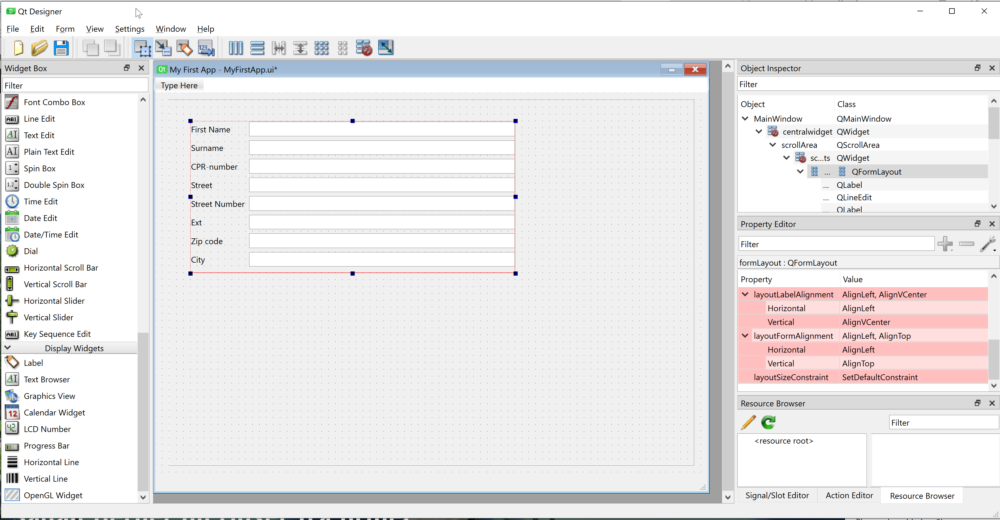

Let us add some 'Push Buttons' For "Register Patient" and "Clear Fields".
You can right-click on the buttons in order to change the text and the object names.

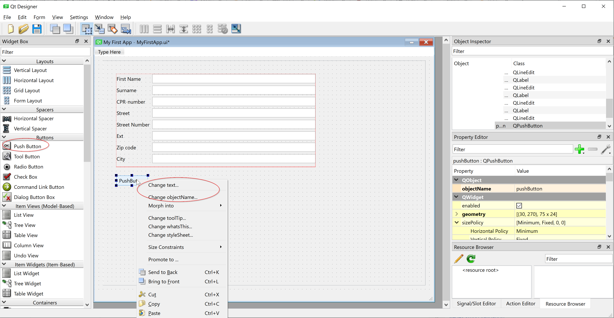

Finally, add a "Text Edit Field" (We will need in order to display the output -
Yes it will be a boring application: It will display the inputs together with
a computed age - it is only made for demonstration purposes and to give you
an idea of what is possible and easy to create wth QT Designer).

The result should look something like this:

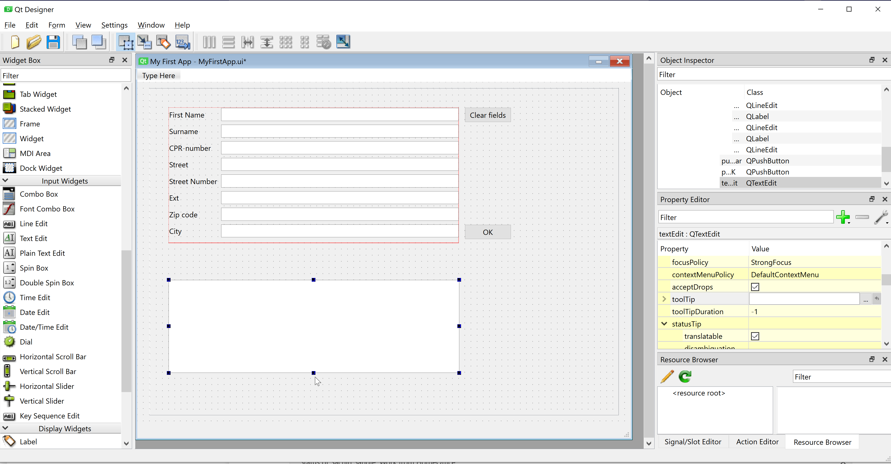

Using the preview (in the forms menu) I get..

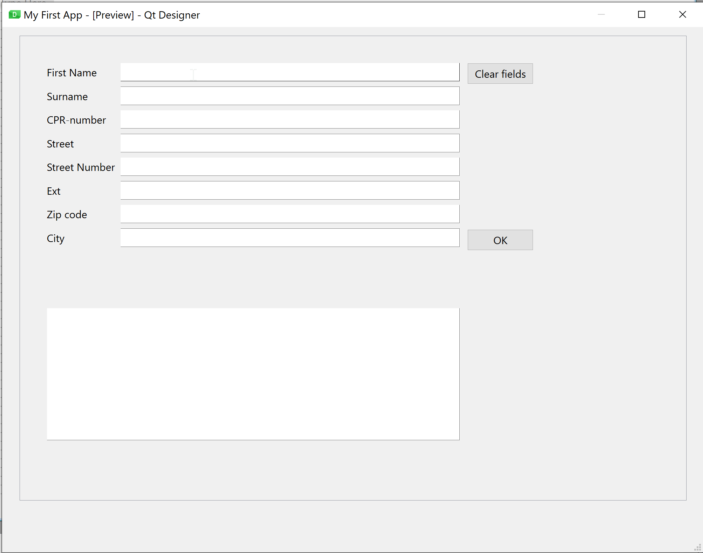


Please notice all the properties you can set on the text fields:
Among others you have tooltips (that is display a little message, when you hover the mouse
over the field) and input masks (That is: allow only certain characters for the input -
practical for CPR numbers)

For a mockup it can also be practical to set some sample text for the input fields.
Feel free to do so! And notice that you can save the UI as an image (png) file.


### The UI file
[to top ^](#system-development-cookbook-2022)

Let us have a look at the resulting ui file (or the first part of it).

```xml
<?xml version="1.0" encoding="UTF-8"?>
<ui version="4.0">
 <class>MainWindow</class>
 <widget class="QMainWindow" name="MainWindow">
  <property name="geometry">
   <rect>
    <x>0</x>
    <y>0</y>
    <width>800</width>
    <height>600</height>
   </rect>
  </property>
  <property name="windowTitle">
   <string>My First App</string>
  </property>
  <widget class="QWidget" name="centralwidget">
   <widget class="QScrollArea" name="scrollArea">
    <property name="geometry">
     <rect>
      <x>20</x>
      <y>10</y>
      <width>761</width>
      <height>531</height>
     </rect>
    </property>
    <property name="widgetResizable">
     <bool>true</bool>
    </property>
    <widget class="QWidget" name="scrollAreaWidgetContents">
     <property name="geometry">
      <rect>
       <x>0</x>
       <y>0</y>
       <width>759</width>
       <height>529</height>
      </rect>
     </property>
     <widget class="QWidget" name="formLayoutWidget">
      <property name="geometry">
       <rect>
        <x>30</x>
        <y>30</y>
        <width>471</width>
        <height>221</height>
       </rect>
      </property>
      <layout class="QFormLayout" name="formLayout">
       <item row="0" column="0">
        <widget class="QLabel" name="firstNameLabel">
         <property name="text">
          <string>First Name</string>
         </property>
        </widget>
       </item>
       <item row="0" column="1">
        <widget class="QLineEdit" name="firstNameLineEdit">
         <property name="toolTip">
          <string/>
         </property>
         <property name="inputMask">
          <string/>
         </property>
         <property name="text">
          <string/>
         </property>
         <property name="placeholderText">
          <string/>
         </property>
         <property name="clearButtonEnabled">
          <bool>true</bool>
         </property>
        </widget>
       </item>
....

```

The full file is located in the repository.

It is an XML (Extensible Markup Language) file and each GUI component
is described via tags and properties. The important ones for now will
be the property names as we will need them in order to refer to them in the Python program.
Other properties can easily be changed via a normal text editor (I can recommend notepad++
if you are using Windows) or you can set up PyCharm as your default editor for UI files.

XML is - as said - a Markup language. You will learn about it later in the course.
Other examples of markup language are HTML or Markdown (which is used to create this cookbook)


## UML using PlantUML
[to top ^](#system-development-cookbook-2022)

The UML (Unified Modeling Language) diagrams for your project can be generated via
The PlantUML plugin in PyCharm (or VScode if you are using VScode).

If you haven't installed the plugin yet, then find it in preferences/settings->plugin->Marketplace
and install it.

It requires that you have installed graphviz (the VScode plugin does that 'automagically' on both Mac
and Windows. In PyCharm we must do a little extra work). 
On Mac you will need to install graphviz via the command `brew install graphviz`.
After you have installed graphviz, then run `which dot`. It should display
something like `/usr/local/bin/dot`.
In Pycharm settings/preferences insert the found result here and you should be
able to render diagrams in plantUML (note that on the implementation on my Windows laptop this 
field is empty.)

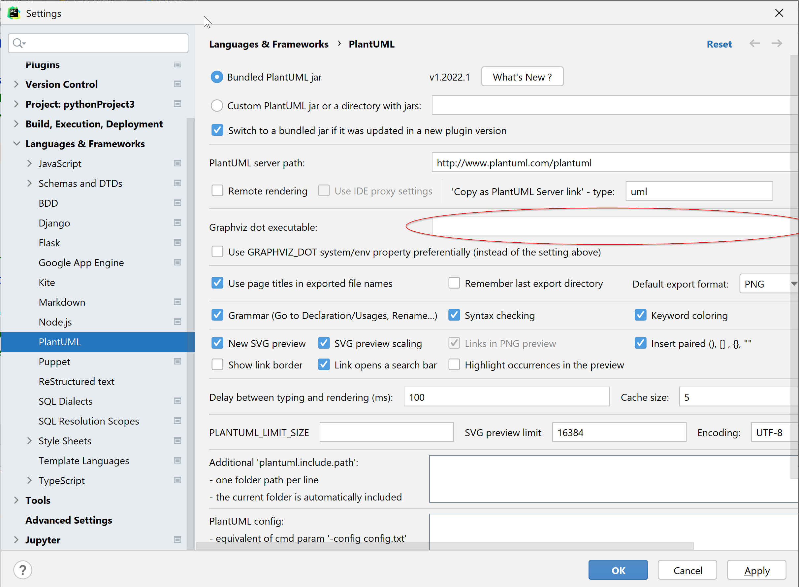

You should now be ready to create your first diagrams:

Right-click in your project explorer and select new and PlantUML File:
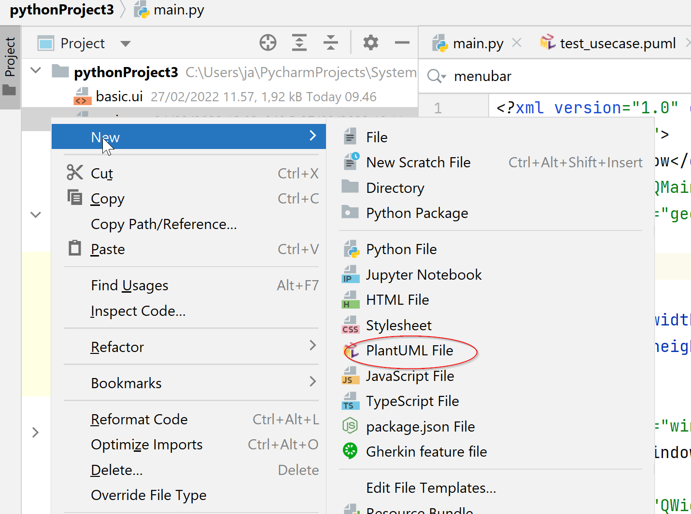

Now select the type of diagram you are going to create.

Here are the generated e xamples of use case and class diagrams:

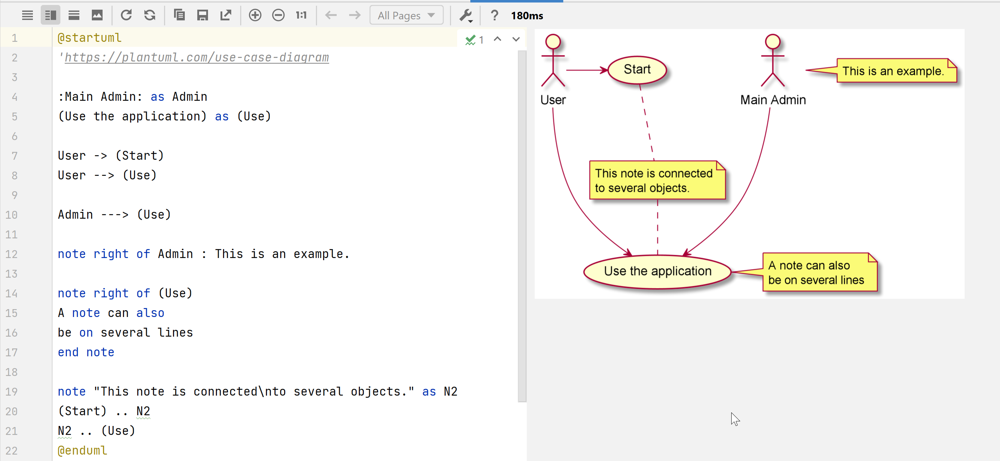
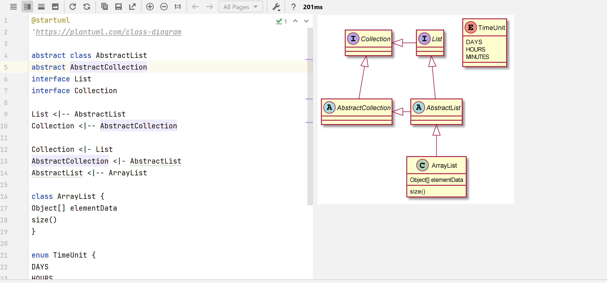

Full documentation for PlantUML syntax and a collection of examples can be 
found here https://plantuml.com/ and here https://real-world-plantuml.com/

Happy UML'ing!

## Python OOP
[to top ^](#system-development-cookbook-2022)

As this is also a course in how to develop software that can easily/easier be reused
I will simply not reinvent the wheel but instead advise you to spend some minutes with this excellent guide on basic OOP in 
Python: https://realpython.com/python3-object-oriented-programming/
(You can choose to register or open the link in incognito mode..)


Key take-outs are  
- Classes vs instances (objects)
- Methods (at class and instance level)
- How to instantiate and object (the `__init__` method - the constructor)
- Special Instance methods (`__str__` - to represent the object as a string)
- Class Inheritance

Once you have familiarized yourself with these basic concepts you might
also want to consult the following page https://realpython.com/instance-class-and-static-methods-demystified/
that explains the difference between instance methods, class methods and static methods (the
latter typically being used for supporting e.g. functions that are independent of
the class or objects).

You might have learned about private, public and protected attributes and methods.
As can be seen here
https://betterprogramming.pub/public-private-and-protected-access-modifiers-in-python-9024f4c1dd4 
the implementation in Python is not strict as in Java or C++ .
The notation being used (`__`for private, `_` for protected) is more to be seen as 
a **strong** recommendation on not to access the attribute from outside the class,
but it is technically still possible (but please don't!)...
A good practise would be to go with properties as explained here in order to get
managed attributes: https://realpython.com/python-property/
(You can choose to register or open the link in incognito mode..)

For now don't worry too much - we will get to see some examples in the weekly exercises and in this cookbook.


## Creating an application using a GUI
[to top ^](#system-development-cookbook-2022)
We have now created a graphical user interface. In week 1 and 2 of the course we created a small
program that just used the console as input.

Let us create a workable application with the user interface we just created.

I have done small modifications to the user interface by adding layout constraints (vertical, grid,
or horizontal layout) to the Qwidgets (the red warning signs on the widgets indicated that they
were missing constraints). This also enabled the scrollbars (which didn't work in the first version). 

On the input fields I have set the maximum width and also the maximum characters.
I have also used an inputMask (Property Editor) on the CPR-number as "999999-9999" and a maxLength of 11 making it impossible to
enter anything but the 10 digits. This way I have better control on what the user inputs.
Same has been done on the Zip code (4 digits).

The TextEdit field has been converted (right click -> morph into) a
plainTextEdit field has this is more suitable for showing plain text.
The TextEdit fields default supports HTML...

Finally, I have enabled clearButtonEnabled for almost all fields (so that you can clear them individually)

I didn't find a way to control the position of the OK button using Designer - I wanted it to
be at the right side in a separate column. So there I opened the `.ui`
file in an editor and changed `<item row="2" column="0">` to `<item row="2" column="1">` in the following section:

```xml
        <item row="2" column="1">
         <widget class="QPushButton" name="pushButtonOK">
          <property name="sizePolicy">
           <sizepolicy hsizetype="Minimum" vsizetype="Fixed">
            <horstretch>1</horstretch>
            <verstretch>0</verstretch>
           </sizepolicy>
          </property>
          <property name="maximumSize">
           <size>
            <width>70</width>
            <height>16777215</height>
           </size>
          </property>
          <property name="text">
           <string>OK</string>
          </property>
         </widget>
        </item>
```


The application doesn't do all the validation that we implemented in the first weeks.
But it takes some input and generates som output, so that you will get and idea of how the various
components of the GUI is being used. I have also added the use of a MessageBox (giving the user a 
warning before the user clears all fields). This way you can see that you can code the various GUI
components directly - you actually don't need to use Designer - but it is a tedious work.
Most likely your final app will be a mixture of what you have Designed in Qt Designer and some
parts of the GUI done by code.

The "first version" of the app can be found in [Cookbook-GUI](Cookbook-GUI) folder
If you place the `main.py` and `MyFirstAppGUI.ui` folder in a new Python project
you should be able to run the program and get something like this showing up on the screen:

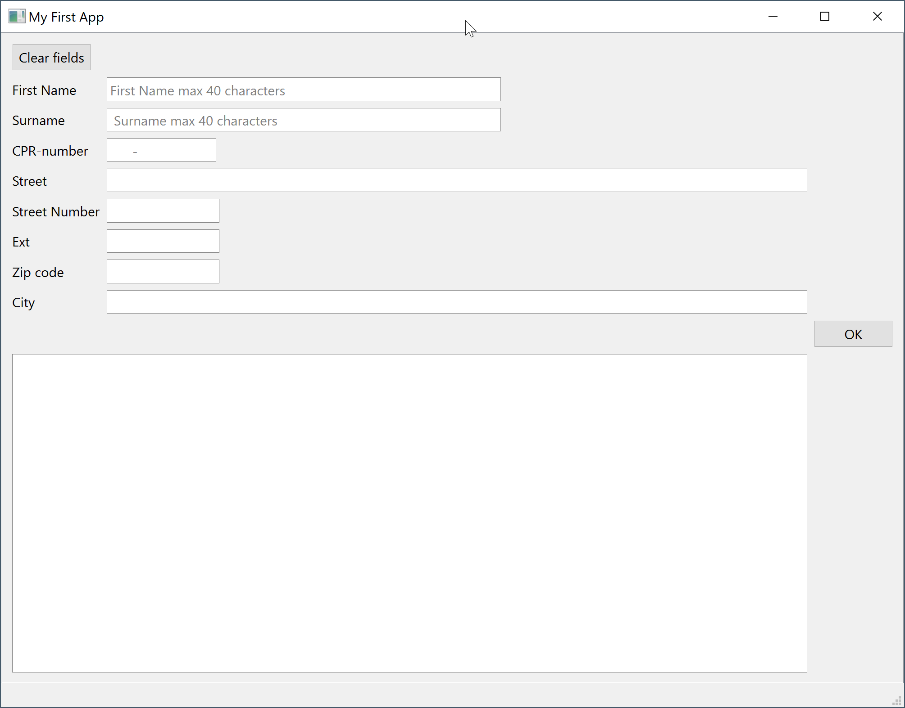

Try to fill out with information and press OK - then you will see something like

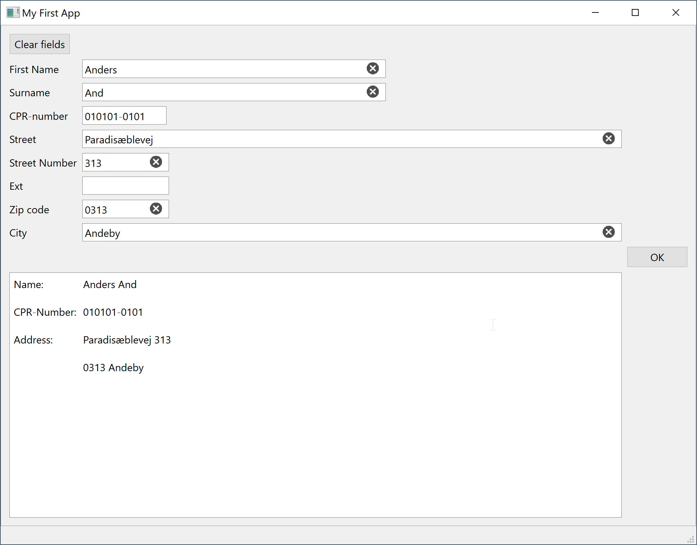

Notice the small crosses in the fields that enables you to clear that field only.

If you press the key labelled `Clear fields` you will see:

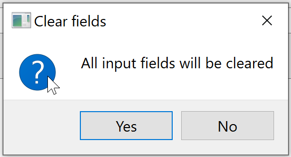

and if you press yes the input fields will be cleared.

### The Python file for the GUI
[to top ^](#system-development-cookbook-2022)

The Python file for the GUI should be more or less self-explanatory through the
comments in the file.

The imports ensure that you can use the QT widgets and that the ui file can be translated
to Python code.

Byt the way: if you are curious about what the Python code for the Qt GUI looks like 
(what Qt Designer does for you), then press "Form->View Python Code" in Qt Designer!

The next part is the Python class that links our program with the Qt ui file.

```python
class MyFirstAppUi(QtWidgets.QMainWindow):
```

You can name the class what you want, but the input parameter must match the widget class being
described in the .ui file. In our case it is a QmainWindow:

```xml
<?xml version="1.0" encoding="UTF-8"?>
<ui version="4.0">
 <class>MainWindow</class>
 <widget class="QMainWindow" name="MainWindow">
  <property name="geometry">
   <rect>
    <x>0</x>
    <y>0</y>

```
    (You could also have created Dialog in qt designer. In that case it
is a QDialog) 

Now the constructor for the class follows 

```python
    def __init__(self):
        super(MyFirstAppUi, self).__init__()   # MyFirstAppUi must be the same as the name of the class
        uic.loadUi('MyFirstAppGUI.ui', self)      # MyFirstAppGUI.ui is the name of your ui file

        # Now define the linking between all your GUI objects (widgets) and the
        # associated methods. E.g. what method (function) is called when the
        # 'OK' button is pressed.
        # Remember that you named the two buttons 'pushButtonOK' and 'pushButtonClear'

        self.pushButtonOK.clicked.connect(self.ok_button_pressed)
        self.pushButtonClear.clicked.connect(self.clear_button_pressed)

        # Don't forget this line! If you do forget, the GUI won't be visible!!

        self.show()
```

The constructor tells what `.ui` file is to be loaded and also defines the
connections between the controllers in you GUI (in this case som push-buttons)
and there associated methods: `ok_button_pressed` and `clear_button_pressed`

Note that the pushButtonOK and pushButtonClear must match the names that you gave the
buttons in your GUI (and hence in your .ui file)

Then follow the two methods we just referred to.
First the method that defines what happens if you press the OK button

```python
    def ok_button_pressed(self):
        # This is executed when the OK button is pressed
        # lets concatenate the values from alle the input fields and write
        # the result in the textEdit field we created:
        print("OK button pressed!")

        # get all the values from the input fields
        name = self.firstNameLineEdit.text()
        surname = self.surnameLineEdit.text()
        cpr_number = self.cPRNumberLineEdit.text()
        street = self.streetLineEdit.text()
        street_number = self.streetNumberLineEdit.text()
        ext = self.extLineEdit.text()
        zip_code = self.zipCodeLineEdit.text()
        city = self.cityLineEdit.text()

        address1 = " ".join((street, street_number, ext))
        address2 = " ".join((zip_code, city))

        # Build the output text

        output_text = "Name:\t"+name+" "+surname \
            + "\n\nCPR-Number:\t"+cpr_number \
            + "\n\nAddress:\t"+address1 \
            + "\n\n\t"+address2

        self.plainTextEdit.setPlainText(output_text)

```

The text from the input fields are read by the .text() method.
Then the output text is being constructed and finally
the resulting text is displayed in the plainTextEdit widget
using the `.setPlainText()` method.

The second method defines what to be done if the `Clear Fields` button
is pressed

```python
    def clear_button_pressed(self):
        # This method is used in order to clear all input fields.
        # A simple, but naive approach will be to call
        # .clear() for all input fields, e.g. self.firstNameLineEdit.clear()
        # however this will require that we maintain the method if we add
        # more fields. A better approach would probably be to find all fields of type
        # LineEdit and clear them!
        # But first present the user with a warning message by using QMessagebox

        print('Clear button pressed!')

        button = QtWidgets.QMessageBox.question(self, "Clear fields", "All input fields will be cleared")

        if button == QtWidgets.QMessageBox.StandardButton.Yes:
            print("Yes!")
            # Find all fields of type QLineEdit
            line_edits = self.findChildren(QtWidgets.QLineEdit)
            # Loop over the fields and clear them
            for field in line_edits:
                field.clear()
        else:
            print("No!")

```

In this method I programmatically create a message box and then
detects whether the user presses Yes or no. If Yes is pressed then
a search for all fields of type QLineEdit is done and the result
is saved in a list. Then an iteration over all fields in the list is done
and for each field the `.clear()` method is being used.


Finally, we have

```python
if __name__ == '__main__':
    app = QtWidgets.QApplication(sys.argv)
    window = MyFirstAppUi()
    app.exec()

```

This basically means that when the Python file is run directly, then the main
method is called (see e.g. https://realpython.com/python-main-function/ for explanation) and
the three next lines are executed.

If you on the other hand had developed methods that could be
used by other Python files (via imports) then the three last lines would not be executed. Quite handy
if you at the same time made e.g. a converter that could be run directly
from the command line and at the same time act as a library to be imported in
Python projects.

The first program is now done. We didn't add data validation etc., but
we have a great platform for doing it.

## Working with classes in Python
[to top ^](#system-development-cookbook-2022)

So far so good! Now let us introduce some classes so that we are
able to make the code more modular and maintainable.

We would like to hold a list of patients and everytime we add a patient we
would like to show the updated list in the output window - including the patients age. 

Let us introduce a Patient class to hold the information about the Patients:
(Put the Patient class in its own file Patient.py)

The Patient class would certain attributes (variables) which describes a patient:
First name, surname, CPR-number, Street name, Street Number and potential extension,
a zip code and a city name.

We will need a constructor which takes inputs for all these attributes.

```python
class Patient:
    def __init__(self, first_name, surname, cpr_number, 
                 street, street_number, street_ext, zip_code, city):
        self.first_name = first_name
        self.surname = surname
        self.cpr_number = cpr_number
        self.street = street
        self.street_number = street_number
        self.street_ext = street_ext
        self.zip_code = zip_code
        self.city =  city
```

We will also need some methods (functions) - apart from the standard "setters and getters" 
(which in  Python are kind of build-in - I will return to that soon) we will need a method to get the age 
(remember we made a function to calculate the age from the CPR-number in one of
the first exercises) and then we will also need the special instance method `.__str__()`.
The latter method will be used to print the information for one patient as a nicely
formatted string.

Let us start with the `.__str__()` method. It is simply a function that returns all the
information in one line (the `get_age()` method will be defined just below):

```python
    def __str__(self):
        name = f"{self.first_name} {self.surname}"
        address = f"{self.street} {self.street_number}, {self.street_ext}, \
        {self.zip_code} {self.city}"
        age = f"{str(self.get_age)}"
        return f"Name: {name}, CPR-Number: {self.cpr_number}, Address: {address}, Age: {age} "
```

Now let us add a `get_age()` method. We will use the method from the function from the solution from Week2_1
and turn it into a method (NB! we will also need to do `from datetime import date` and from
`from stdnum.dk import cpr` for this to work).

```python
    def get_age(self):
        cpr_number_in = cpr.compact(self.cpr_number)
        today_date = date.today()
        birth_date = cpr.get_birth_date(cpr_number_in)
        age_date = today_date - birth_date
        return int(age_date.days/365.2425)
```

)

As we wanted to let to the GUI update the list of patients, whenever a patient is added,
we will add a list a of Patients to the `MyFirstAppUi` class and update that list with
the newly entered patient.

It is all put together in the [`Cookbook-GUI-2`](Cookbook-GUI-2) folder:

The ui file defines the User interface. I have added a File->Exit menu.
The associated action is associated via `self.actionExit.triggered.connect(self.exit_button_pressed)` and
the behaviour defined in the `exit_button_pressed` method (in our case the window is just closed).
The Patient Class and MyFirsAppUI Class have their own python files.
MyFirsAppUI has been given an extra parameter `patient_list` - check the constructor!
The idea is to pass the current patient list to the MyFirstAppUI object which then
is able to update the list.

The main.py initiates an empty patient list.
It then prints out the list (to show it is empty).

Every time a patient is added in the GUI, a Patient object is created and added to the list.
The list is then displayed in the GUI.

If the user press file->exit, the window is closed, and we are returned to the __main__ method in main.py.
Here the updated list of patients is printed to the console.

Hopefully you now have an idea on how to create a GUI with PyQT, how to capture user input,
how to work with (list of) objects and how to pass information to and from a Window (e.g. it could
be relevant to pass an object with information on the currently logged-in user: In your assigment
case that could e.g. be student, teacher, TA, course administrator etc.)

By the way: You are free to add a 'Validator' class which you can use to validate your user input :wink: .

### A note on setters and getters
[to top ^](#system-development-cookbook-2022)

'Setters' and 'getters' are methods that are used in object-oriented programming languages to access an object's private attribute.
You can use setters and getters in your projects (e.g. patient.get_address(), patient.set_street("Nørrebrogade"))
even though it wouldn't be the 'pythonic' way to do it: 
see e.g. https://python-course.eu/oop/properties-vs-getters-and-setters.php how to use properties.
This is one of areas where Python differentiates from other OOP languages.

## Generating and parsing XML files
[to top ^](#system-development-cookbook-2022)

In your assignment you are asked to generate XML files from you data and import data from XML files into your system.
You can here find two examples of how this can be achieved.

The first method found in the [XML](XML) folder is - as explained - a quick
and dirty solution with some restrictions.

The second (preferred) method can be found in [XML-2](XML-2) and is a much more
flexible approach that e.g. decouples the class attribute names from the XML tag names.
(e.g. allowing you to call the attributes "phone_number" but the corresponding XML tag name "telefonnummer").
It will also work faster for large systems, as it doesn't have to do an intermediate translation to json.

Read the Readme files in the two folders for better understanding.


